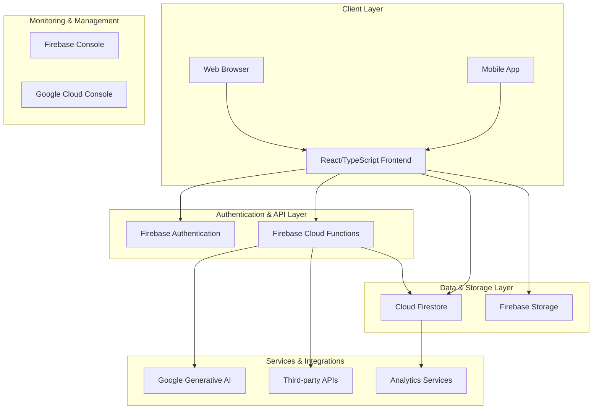

# Language Learning Management System - Architecture Plan

## 1. High-Level System Architecture Diagram

## 2. Component Breakdown with Responsibilities

### 2.1 Frontend Components

#### Authentication Module
- **AuthContext**: Manages user authentication state and provides authentication methods
- **AuthService**: Handles user registration, login, logout, and password reset operations
- **ProtectedRoute**: Ensures only authenticated users can access certain routes

#### User Interface Components
- **Dashboard Components**: 
  - StudentDashboard: Displays student-specific information and progress
  - TeacherDashboard: Provides tools for teachers to manage classes and students
- **Learning Components**:
  - SubjectManagement: Handles subject selection and navigation
  - LessonManagement: Manages lesson content and progression
  - QuizInterface: Delivers interactive quiz experiences
- **Progress Tracking Components**:
  - StudentProgressTracker: Visualizes student learning progress
  - TeacherAnalyticsDashboard: Provides insights into student performance
- **Communication Components**:
  - MessagingSystem: Facilitates communication between teachers and students
 - NotificationCenter: Delivers system notifications and updates

#### Core Functional Modules
- **Contest Module**: Manages competitive learning experiences
- **Achievement Module**: Tracks and awards student accomplishments
- **Resource Sharing Module**: Enables sharing of learning materials
- **Attendance Module**: Tracks student participation and engagement
- **Portfolio Module**: Showcases student work and accomplishments

### 2.2 Backend Services (Firebase Cloud Functions)

#### Authentication Services
- User registration and profile creation
- Role-based access control (student/teacher/admin)
- Session management and token validation

#### Business Logic Services
- Quiz generation and management
- Assignment distribution and grading
- Progress tracking and analytics
- Contest management and leaderboard calculations
- Automated feedback and recommendations

#### Integration Services
- Google Generative AI for content creation
- Third-party API integrations for additional resources
- Email/SMS notifications for important events

### 2.3 Data Layer (Cloud Firestore)

#### User Data Collections
- `users`: Stores user profiles, roles, and preferences
- `userProfiles`: Detailed user information including learning history
- `userPreferences`: Customization settings for individual users

#### Learning Content Collections
- `subjects`: Available learning subjects and categories
- `lessons`: Individual lesson content and resources
- `quizzes`: Quiz questions and assessment tools
- `resources`: Shared learning materials and documents

#### Progress & Performance Collections
- `userProgress`: Tracks completion status for lessons and quizzes
- `quizAttempts`: Records student quiz attempts and scores
- `achievements`: System-defined achievements and badges
- `userAchievements`: Records unlocked achievements for each user
- `studentPortfolios`: Showcase of student work and accomplishments

#### Class Management Collections
- `classes`: Class information and enrollment
- `teacherClasses`: Teacher-specific class management
- `studentClasses`: Student class enrollment and status
- `assignments`: Distributed learning tasks and deadlines
- `submissions`: Student assignment submissions and grades

#### Communication Collections
- `messages`: Direct messaging between users
- `announcements`: Class-wide notifications from teachers
- `discussions`: Forum-style discussions on learning topics

#### Administrative Collections
- `systemSettings`: Global system configuration
- `auditLogs`: Security and usage tracking
- `reports`: Generated analytics and performance reports

## 3. Data Flow Patterns

### 3.1 User Authentication Flow
1. User accesses application through web or mobile client
2. Client requests authentication through Firebase Auth
3. Firebase Auth validates credentials and returns authentication token
4. Client fetches user profile from Firestore
5. Application loads appropriate dashboard based on user role

### 3.2 Learning Content Delivery Flow
1. Student navigates to a subject or lesson
2. Client requests content from Firestore
3. Firestore returns lesson content and associated resources
4. Client renders content with interactive elements
5. Student interactions are saved to progress tracking collections

### 3.3 Assessment and Grading Flow
1. Student initiates a quiz or assignment
2. Client retrieves assessment content from Firestore
3. Student completes assessment with real-time validation
4. Results are submitted to Cloud Functions for processing
5. Cloud Functions calculate scores and update progress collections
6. Teachers can access grading information through analytics dashboard

### 3.4 Progress Tracking Flow
1. System continuously monitors user interactions and completions
2. Progress data is aggregated and stored in Firestore
3. Analytics services process data to generate insights
4. Dashboards display visual representations of progress
5. Notifications are triggered based on milestones and achievements

## 4. Integration Points with Firebase Services

### 4.1 Firebase Authentication
- User registration and authentication
- Role-based access control
- Session management
- Social login integration (Google, etc.)

### 4.2 Cloud Firestore
- Real-time data synchronization
- Structured data storage
- Query and indexing capabilities
- Offline data persistence

### 4.3 Firebase Storage
- Storage of learning materials (PDFs, videos, images)
- User-generated content (assignments, projects)
- Resource sharing between teachers and students

### 4.4 Firebase Cloud Functions
- Serverless business logic execution
- Automated grading and assessment
- Notification triggers
- Data aggregation and analytics

### 4.5 Firebase Hosting
- Web application deployment
- Content delivery network (CDN) for fast loading
- SSL certificate management

### 4.6 Firebase Analytics
- User behavior tracking
- Feature usage analytics
- Performance monitoring

## 5. Security Considerations

### 5.1 Authentication Security
- Multi-factor authentication support
- Secure password policies
- Session timeout and renewal mechanisms
- Role-based access control implementation

### 5.2 Data Security
- End-to-end encryption for sensitive data
- Firestore security rules to prevent unauthorized access
- Regular security audits and penetration testing
- Data backup and disaster recovery procedures

### 5.3 Privacy Compliance
- GDPR and other regional privacy regulation compliance
- User consent management for data collection
- Data anonymization for analytics purposes
- Right to deletion and data portability implementation

### 5.4 Application Security
- Input validation and sanitization
- Protection against common web vulnerabilities (XSS, CSRF)
- Secure API communication with proper headers
- Regular dependency updates and vulnerability scanning

## 6. Scalability Recommendations

### 6.1 Horizontal Scaling
- Use of Firebase's auto-scaling capabilities
- Implementation of pagination for large data sets
- Caching strategies for frequently accessed data
- Load distribution across multiple Cloud Functions

### 6.2 Database Optimization
- Proper indexing of Firestore collections
- Data denormalization for frequently accessed information
- Use of Firestore bundles for pre-fetched content
- Implementation of data archiving for historical records

### 6.3 Performance Optimization
- Code splitting and lazy loading for frontend components
- Image optimization and compression
- Implementation of service workers for offline functionality
- CDN utilization for static assets

### 6.4 Geographic Distribution
- Multi-region deployment for global accessibility
- Content delivery network utilization
- Regional data storage compliance
- Latency optimization for different user locations

## 7. Technology Stack Details

### 7.1 Frontend Technologies
- **React**: Component-based UI library for building interactive interfaces
- **TypeScript**: Typed superset of JavaScript for improved code quality
- **Vite**: Fast build tool and development server
- **Tailwind CSS**: Utility-first CSS framework for styling
- **Shadcn/ui**: Reusable component library built on Radix UI
- **Framer Motion**: Animation library for enhanced user experience
- **React Router**: Declarative routing for React applications

### 7.2 Backend Technologies
- **Firebase Cloud Functions**: Serverless computing platform
- **Node.js**: JavaScript runtime for backend services
- **Express.js**: Web application framework (if needed for custom APIs)

### 7.3 Database Technologies
- **Cloud Firestore**: NoSQL document database with real-time capabilities
- **Firebase Realtime Database**: For specific real-time use cases (if needed)

### 7.4 Authentication Technologies
- **Firebase Authentication**: Comprehensive authentication system
- **Google Identity Platform**: For social login integrations

### 7.5 Storage Technologies
- **Firebase Storage**: Secure file storage and serving

### 7.6 AI and Machine Learning
- **Google Generative AI**: For content creation and personalization
- **Firebase ML**: For on-device machine learning capabilities

### 7.7 Development and Deployment Tools
- **Firebase CLI**: Command-line interface for Firebase development
- **GitHub Actions**: CI/CD pipeline automation
- **ESLint**: Code linting and quality assurance
- **Prettier**: Code formatting tool

## 8. Review of Existing Implementation

The existing project already has a solid foundation with:
- Authentication system with role-based access (student/teacher)
- Quiz and lesson management capabilities
- Progress tracking and achievement systems
- Contest functionality for competitive learning
- Firestore data structure with appropriate collections
- Security rules implementation

The architecture plan builds upon this foundation by:
- Expanding class management capabilities
- Enhancing communication tools
- Adding resource sharing functionality
- Implementing attendance tracking
- Improving analytics and reporting
- Extending multi-language support
- Enhancing offline functionality