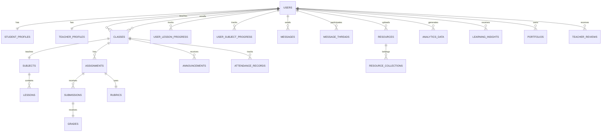

# Firebase Data Structure for Language Learning Management System

## 1. Overview

This document defines a comprehensive Firebase data structure for a language learning management system. The structure is designed to support all aspects of language education, including user management, course content, class organization, assessment, communication, and analytics.

## 2. Collection Structure

### 2.1 User Profiles

#### 2.1.1 Users Collection
The `users` collection stores core user information and authentication data.

**Document Structure:**
```javascript
{
  uid: string,                    // Firebase Authentication UID
  email: string,                  // User's email address
  displayName: string,            // User's full name
  photoURL: string,               // URL to user's profile picture
 role: "student" | "teacher" | "admin",  // User role
  createdAt: timestamp,           // Account creation timestamp
  lastLoginAt: timestamp,         // Last login timestamp
  isActive: boolean,              // Account status
  preferences: {
    language: string,             // Preferred language
    timezone: string,             // User's timezone
    notifications: {
      email: boolean,             // Email notifications enabled
      push: boolean               // Push notifications enabled
    }
  }
}
```

#### 2.1.2 Student Profiles Collection
The `studentProfiles` collection stores detailed information specific to students.

**Document Structure:**
```javascript
{
  userId: string,                 // Reference to user document
  age: number,                    // Student's age
  gradeLevel: string,             // Current grade level
  school: string,                 // School name
  location: string,               // Geographic location
  nativeLanguage: string,         // Student's native language
  targetLanguages: string[],      // Languages being learned
  learningGoals: string[],        // Learning objectives
  proficiencyLevel: {
    speaking: "beginner" | "intermediate" | "advanced" | "fluent",
    listening: "beginner" | "intermediate" | "advanced" | "fluent",
    reading: "beginner" | "intermediate" | "advanced" | "fluent",
    writing: "beginner" | "intermediate" | "advanced" | "fluent"
  },
  xp: number,                     // Total experience points
  level: number,                  // Current level
  streak: number,                 // Current learning streak
  lastStreakDate: timestamp,      // Last streak date
  enrolledClasses: string[],      // Array of class IDs
  achievements: string[],         // Array of achievement IDs
  createdAt: timestamp,
  updatedAt: timestamp
}
```

#### 2.1.3 Teacher Profiles Collection
The `teacherProfiles` collection stores detailed information specific to teachers.

**Document Structure:**
```javascript
{
  userId: string,                 // Reference to user document
  qualifications: string[],        // Educational qualifications
  specializations: string[],      // Language specializations
  yearsOfExperience: number,      // Teaching experience
  bio: string,                    // Teacher biography
  school: string,                 // School/Institution
  location: string,               // Geographic location
  teachingLanguages: string[],    // Languages taught
  availability: {
    monday: { start: string, end: string },   // Time format: "HH:MM"
    tuesday: { start: string, end: string },
    wednesday: { start: string, end: string },
    thursday: { start: string, end: string },
    friday: { start: string, end: string },
    saturday: { start: string, end: string },
    sunday: { start: string, end: string }
  },
  rating: number,                 // Average rating (0-5)
  totalRatings: number,           // Number of ratings received
  classesTaught: string[],        // Array of class IDs
  createdAt: timestamp,
  updatedAt: timestamp
}
```

### 2.2 Course Catalog

#### 2.2.1 Subjects Collection
The `subjects` collection stores information about different language learning subjects.

**Document Structure:**
```javascript
{
  id: string,                     // Subject ID
  name: string,                   // Subject name (e.g., "Spanish Basics")
  description: string,            // Detailed description
  language: string,               // Target language
  level: "beginner" | "intermediate" | "advanced" | "fluent",  // Difficulty level
  category: string,               // Subject category (e.g., "Grammar", "Conversation")
  icon: string,                   // Icon identifier
  color: string,                  // Theme color
  estimatedDuration: number,      // Estimated completion time in hours
  prerequisites: string[],        // Required subjects
  learningOutcomes: string[],     // Expected learning outcomes
  totalLessons: number,           // Total number of lessons
  completedLessons: number,       // Number of completed lessons
  progress: number,               // Overall progress percentage
  isPublished: boolean,           // Publication status
  createdBy: string,              // Teacher user ID
  createdAt: timestamp,
  updatedAt: timestamp
}
```

#### 2.2.2 Lessons Collection
The `lessons` collection stores individual lesson content and resources.

**Document Structure:**
```javascript
{
  id: string,                     // Lesson ID
  subjectId: string,              // Parent subject ID
  title: string,                  // Lesson title
  description: string,            // Lesson description
  content: string,                // Rich text content or markdown
  order: number,                  // Sequence order within the subject
  difficulty: "beginner" | "intermediate" | "advanced",  // Difficulty level
  estimatedDuration: number,      // Estimated completion time in minutes
  objectives: string[],           // Learning objectives
  vocabulary: {
    word: string,
    translation: string,
    example: string
  }[],                            // Key vocabulary for the lesson
  resources: {
    id: string,
    type: "video" | "pdf" | "link" | "image" | "audio" | "exercise",
    title: string,
    url: string,
    description: string
  }[],                            // Additional resources
  quizId: string,                 // Optional quiz associated with lesson
  isPublished: boolean,           // Publication status
  createdBy: string,              // Teacher who created the lesson
  createdAt: timestamp,
  updatedAt: timestamp
}
```

### 2.3 Class Management

#### 2.3.1 Classes Collection
The `classes` collection stores information about language learning classes.

**Document Structure:**
```javascript
{
  id: string,                     // Class ID
  name: string,                   // Class name
  description: string,            // Class description
  subjectId: string,              // Associated subject ID
  teacherId: string,              // Teacher user ID
  language: string,               // Language being taught
  level: "beginner" | "intermediate" | "advanced" | "fluent",  // Class level
  schedule: {
    dayOfWeek: "monday" | "tuesday" | "wednesday" | "thursday" | "friday" | "saturday" | "sunday",
    startTime: string,            // Time format: "HH:MM"
    endTime: string,              // Time format: "HH:MM"
    timezone: string              // Timezone
  },
  startDate: timestamp,           // Class start date
  endDate: timestamp,             // Class end date
  maxStudents: number,            // Maximum number of students
  currentStudents: number,        // Current number of enrolled students
  studentIds: string[],           // Array of enrolled student IDs
  isActive: boolean,              // Class status
  createdAt: timestamp,
  updatedAt: timestamp
}
```

#### 2.3.2 Class Enrollments Collection
The `classEnrollments` collection tracks student enrollment in classes.

**Document Structure:**
```javascript
{
  id: string,                     // Enrollment ID
  classId: string,                // Class ID
  studentId: string,              // Student user ID
  enrollmentDate: timestamp,      // Enrollment date
  status: "enrolled" | "completed" | "dropped",  // Enrollment status
  progress: number,               // Class progress percentage
  finalGrade: number,             // Final grade (0-100)
  attendanceRate: number,         // Attendance percentage
  createdAt: timestamp,
  updatedAt: timestamp
}
```

### 2.4 Assignment System

#### 2.4.1 Assignments Collection
The `assignments` collection stores information about distributed assignments.

**Document Structure:**
```javascript
{
  id: string,                     // Assignment ID
  classId: string,                // Associated class ID
  teacherId: string,              // Teacher user ID
  title: string,                  // Assignment title
  description: string,            // Assignment description
  type: "homework" | "project" | "presentation" | "written_test" | "oral_test",
  instructions: string,            // Detailed instructions
  resources: {
    id: string,
    type: "file" | "link",
    title: string,
    url: string
  }[],                            // Attached resources
  dueDate: timestamp,             // Due date
  assignedDate: timestamp,        // Assignment date
  maxPoints: number,              // Maximum points possible
  rubricId: string,               // Associated rubric ID
  submissions: {
    studentId: string,
    submittedAt: timestamp,
    status: "submitted" | "graded" | "late"
  }[],                            // Submission tracking
  isPublished: boolean,           // Publication status
  createdAt: timestamp,
  updatedAt: timestamp
}
```

#### 2.4.2 Submissions Collection
The `submissions` collection stores student assignment submissions.

**Document Structure:**
```javascript
{
  id: string,                     // Submission ID
  assignmentId: string,           // Parent assignment ID
  classId: string,                // Associated class ID
  studentId: string,              // Student user ID
  submissionDate: timestamp,      // Submission date
  content: string,                // Text content or file URLs
  files: {
    name: string,
    url: string,
    size: number
  }[],                            // Attached files
  wordCount: number,              // Word count (for written assignments)
  timeSpent: number,              // Time spent in minutes
  status: "submitted" | "graded" | "late",  // Submission status
  grade: number,                  // Assigned grade
  feedback: string,               // Teacher feedback
  gradedBy: string,               // Teacher user ID who graded
  gradedAt: timestamp,            // Grading date
  createdAt: timestamp,
  updatedAt: timestamp
}
```

### 2.5 Grading System

#### 2.5.1 Rubrics Collection
The `rubrics` collection stores grading rubrics for assignments.

**Document Structure:**
```javascript
{
  id: string,                     // Rubric ID
  name: string,                   // Rubric name
  description: string,            // Rubric description
  criteria: {
    id: string,
    name: string,                 // Criterion name
    description: string,          // Criterion description
    maxPoints: number,            // Maximum points for this criterion
    weight: number                // Weight percentage (0-100)
  }[],                            // Grading criteria
  totalPoints: number,            // Total points possible
  createdBy: string,              // Teacher user ID
  isPublic: boolean,              // Public availability
  createdAt: timestamp,
  updatedAt: timestamp
}
```

#### 2.5.2 Grades Collection
The `grades` collection stores individual grade records.

**Document Structure:**
```javascript
{
  id: string,                     // Grade ID
  studentId: string,              // Student user ID
  classId: string,                // Associated class ID
  assignmentId: string,           // Associated assignment ID
  rubricId: string,               // Associated rubric ID
  totalPoints: number,            // Total points possible
  earnedPoints: number,           // Points earned
  percentage: number,             // Grade percentage
  letterGrade: "A+" | "A" | "A-" | "B+" | "B" | "B-" | "C+" | "C" | "C-" | "D" | "F",
  detailedScores: {
    criterionId: string,
    points: number,
    feedback: string
  }[],                            // Scores for each rubric criterion
  feedback: string,               // Overall feedback
  gradedBy: string,               // Teacher user ID
  gradedAt: timestamp,            // Grading timestamp
  createdAt: timestamp,
  updatedAt: timestamp
}
```

### 2.6 Progress Tracking

#### 2.6.1 User Lesson Progress Collection
The `userLessonProgress` collection tracks individual lesson completion.

**Document Structure:**
```javascript
{
  id: string,                     // Progress ID
  userId: string,                 // User ID
  lessonId: string,               // Lesson ID
  subjectId: string,              // Subject ID
  status: "not_started" | "in_progress" | "completed",  // Progress status
  progress: number,               // Completion percentage (0-100)
  timeSpent: number,              // Time spent in minutes
  startedAt: timestamp,           // Start timestamp
  completedAt: timestamp,         // Completion timestamp
  lastAccessedAt: timestamp,      // Last access timestamp
  quizScore: number,              // Associated quiz score
  notes: string,                  // Student's notes
  createdAt: timestamp,
  updatedAt: timestamp
}
```

#### 2.6.2 User Subject Progress Collection
The `userSubjectProgress` collection tracks subject-level progress.

**Document Structure:**
```javascript
{
  id: string,                     // Progress ID
  userId: string,                 // User ID
  subjectId: string,              // Subject ID
  status: "not_started" | "in_progress" | "completed",  // Progress status
  progress: number,               // Completion percentage (0-100)
  totalLessons: number,           // Total lessons in subject
  completedLessons: number,       // Completed lessons
  timeSpent: number,              // Total time spent in minutes
  startedAt: timestamp,           // Start timestamp
  completedAt: timestamp,         // Completion timestamp
  lastAccessedAt: timestamp,      // Last access timestamp
  averageQuizScore: number,       // Average quiz score
  createdAt: timestamp,
  updatedAt: timestamp
}
```

### 2.7 Communication System

#### 2.7.1 Messages Collection
The `messages` collection stores direct messages between users.

**Document Structure:**
```javascript
{
  id: string,                     // Message ID
  threadId: string,               // Conversation thread ID
  senderId: string,               // Sender user ID
  recipientId: string,            // Recipient user ID
  content: string,                // Message content
  messageType: "text" | "file" | "image" | "audio",  // Message type
  attachments: {
    name: string,
    url: string,
    type: string
  }[],                            // Attached files
  isRead: boolean,                // Read status
  sentAt: timestamp,              // Send timestamp
  readAt: timestamp               // Read timestamp
}
```

#### 2.7.2 Message Threads Collection
The `messageThreads` collection organizes message conversations.

**Document Structure:**
```javascript
{
  id: string,                     // Thread ID
  participants: string[],         // User IDs of participants
  subject: string,                // Thread subject
  lastMessage: string,            // Last message content
  lastMessageAt: timestamp,       // Last message timestamp
  unreadCount: {
    userId: string,
    count: number
  }[],                            // Unread message counts per user
  isArchived: {
    userId: string,
    archived: boolean
  }[],                            // Archive status per user
  createdAt: timestamp,
  updatedAt: timestamp
}
```

#### 2.7.3 Announcements Collection
The `announcements` collection stores class-wide announcements.

**Document Structure:**
```javascript
{
  id: string,                     // Announcement ID
  classId: string,                // Associated class ID
  teacherId: string,              // Teacher user ID
  title: string,                  // Announcement title
  content: string,                // Announcement content
  attachments: {
    name: string,
    url: string,
    type: string
  }[],                            // Attached files
  priority: "low" | "medium" | "high",  // Announcement priority
  isPublished: boolean,           // Publication status
  publishedAt: timestamp,         // Publication timestamp
  expiresAt: timestamp,           // Expiration timestamp
  createdAt: timestamp,
  updatedAt: timestamp
}
```

### 2.8 Resource Sharing

#### 2.8.1 Resources Collection
The `resources` collection stores shared learning materials.

**Document Structure:**
```javascript
{
  id: string,                     // Resource ID
  title: string,                  // Resource title
  description: string,            // Resource description
  type: "document" | "video" | "audio" | "image" | "link" | "exercise",
  fileUrl: string,                // File URL (if applicable)
  externalUrl: string,            // External link (if applicable)
  fileSize: number,               // File size in bytes
  language: string,               // Resource language
  level: "beginner" | "intermediate" | "advanced" | "fluent",  // Difficulty level
  tags: string[],                 // Resource tags
  subjectIds: string[],           // Associated subject IDs
  uploadedBy: string,             // Uploader user ID
  downloadCount: number,          // Number of downloads
  likeCount: number,              // Number of likes
  isPublic: boolean,              // Public availability
  createdAt: timestamp,
  updatedAt: timestamp
}
```

#### 2.8.2 Resource Collections Collection
The `resourceCollections` collection groups related resources.

**Document Structure:**
```javascript
{
  id: string,                     // Collection ID
  name: string,                   // Collection name
  description: string,            // Collection description
  resourceIds: string[],          // Resource IDs in collection
  createdBy: string,              // Creator user ID
  isPublic: boolean,              // Public availability
  tags: string[],                 // Collection tags
  createdAt: timestamp,
  updatedAt: timestamp
}
```

### 2.9 Attendance Tracking

#### 2.9.1 Attendance Records Collection
The `attendanceRecords` collection tracks student attendance.

**Document Structure:**
```javascript
{
  id: string,                     // Attendance record ID
  classId: string,                // Class ID
  studentId: string,              // Student user ID
  date: timestamp,                // Attendance date
  status: "present" | "absent" | "late" | "excused",  // Attendance status
  checkInTime: timestamp,         // Check-in timestamp
  checkOutTime: timestamp,        // Check-out timestamp
  notes: string,                  // Additional notes
 recordedBy: string,             // Teacher user ID
  createdAt: timestamp,
  updatedAt: timestamp
}
```

#### 2.9.2 Attendance Summary Collection
The `attendanceSummary` collection stores aggregated attendance data.

**Document Structure:**
```javascript
{
  id: string,                     // Summary ID
  classId: string,                // Class ID
  studentId: string,              // Student user ID
  month: number,                  // Month (1-12)
  year: number,                   // Year
  totalClasses: number,           // Total classes in period
  present: number,                // Number of present days
  absent: number,                 // Number of absent days
  late: number,                   // Number of late arrivals
  excused: number,                // Number of excused absences
  attendanceRate: number,         // Attendance percentage
  createdAt: timestamp,
  updatedAt: timestamp
}
```

### 2.10 Performance Analytics

#### 2.10.1 Analytics Data Collection
The `analyticsData` collection stores performance analytics.

**Document Structure:**
```javascript
{
  id: string,                     // Analytics record ID
  userId: string,                 // User ID (optional for class analytics)
  classId: string,                // Class ID (optional for user analytics)
  period: "daily" | "weekly" | "monthly" | "yearly",  // Analytics period
  date: timestamp,                // Date of analytics
  metrics: {
    timeSpent: number,            // Time spent learning (minutes)
    lessonsCompleted: number,     // Lessons completed
    quizzesTaken: number,         // Quizzes taken
    averageQuizScore: number,     // Average quiz score
    resourcesViewed: number,      // Resources viewed
    messagesSent: number,         // Messages sent
    streakMaintained: boolean     // Streak maintained
  },
  createdAt: timestamp
}
```

#### 2.10.2 Learning Insights Collection
The `learningInsights` collection stores AI-generated learning insights.

**Document Structure:**
```javascript
{
  id: string,                     // Insight ID
  userId: string,                 // User ID
  generatedAt: timestamp,         // Generation timestamp
  insights: {
    strength: string,             // Identified strength
    weakness: string,             // Identified weakness
    recommendation: string,       // Personalized recommendation
    nextSteps: string             // Suggested next steps
  }[],
  createdAt: timestamp
}
```

### 2.11 Student Portfolios

#### 2.11.1 Portfolios Collection
The `portfolios` collection stores student portfolios.

**Document Structure:**
```javascript
{
  id: string,                     // Portfolio ID
  studentId: string,              // Student user ID
  title: string,                  // Portfolio title
  description: string,            // Portfolio description
  items: {
    id: string,
    type: "assignment" | "project" | "achievement" | "writing" | "recording",
    title: string,
    description: string,
    url: string,
    date: timestamp
  }[],                            // Portfolio items
  isPublic: boolean,              // Public visibility
  tags: string[],                 // Portfolio tags
  createdAt: timestamp,
  updatedAt: timestamp
}
```

### 2.12 Teacher Evaluations

#### 2.12.1 Teacher Reviews Collection
The `teacherReviews` collection stores teacher evaluations.

**Document Structure:**
```javascript
{
  id: string,                     // Review ID
  teacherId: string,              // Teacher user ID
  studentId: string,              // Student user ID
  classId: string,                // Associated class ID
  rating: number,                 // Rating (1-5)
  comment: string,                // Review comment
  criteria: {
    knowledge: number,            // Knowledge rating (1-5)
    communication: number,        // Communication rating (1-5)
    engagement: number,           // Engagement rating (1-5)
    feedback: number              // Feedback rating (1-5)
  },
  isApproved: boolean,            // Approval status
  createdAt: timestamp,
  updatedAt: timestamp
}
```

### 2.13 Multi-Language Content Organization

#### 2.13.1 Language Packs Collection
The `languagePacks` collection stores language-specific content packs.

**Document Structure:**
```javascript
{
  id: string,                     // Language pack ID
  language: string,               // Target language
  name: string,                   // Pack name
  description: string,            // Pack description
  level: "beginner" | "intermediate" | "advanced" | "fluent",  // Difficulty level
  content: {
    phrases: {
      id: string,
      original: string,
      translation: string,
      audioUrl: string
    }[],
    grammar: {
      id: string,
      rule: string,
      explanation: string,
      examples: string[]
    }[],
    vocabulary: {
      id: string,
      word: string,
      translation: string,
      partOfSpeech: string,
      example: string,
      audioUrl: string
    }[]
  },
  isPublic: boolean,              // Public availability
  createdBy: string,              // Creator user ID
  createdAt: timestamp,
  updatedAt: timestamp
}
```

## 3. Field Definitions and Data Types

All fields use standard Firestore data types:

- **string**: Text data
- **number**: Numeric data (integers and floats)
- **boolean**: True/false values
- **timestamp**: Date and time values
- **array**: Lists of values
- **map**: Object-like structures
- **reference**: Document references (stored as strings in this structure)

## 4. Collection Relationships

The following diagram illustrates the relationships between collections:



## 5. Indexing Strategies

To optimize query performance, the following indexes should be created:

### 5.1 Single-Field Indexes
- `users.email` (ascending)
- `users.role` (ascending)
- `studentProfiles.userId` (ascending)
- `teacherProfiles.userId` (ascending)
- `subjects.language` (ascending)
- `subjects.level` (ascending)
- `lessons.subjectId` (ascending)
- `classes.teacherId` (ascending)
- `classes.subjectId` (ascending)
- `assignments.classId` (ascending)
- `submissions.assignmentId` (ascending)
- `submissions.studentId` (ascending)
- `grades.studentId` (ascending)
- `userLessonProgress.userId` (ascending)
- `userSubjectProgress.userId` (ascending)
- `messages.threadId` (ascending)
- `messages.senderId` (ascending)
- `messages.recipientId` (ascending)
- `attendanceRecords.classId` (ascending)
- `attendanceRecords.studentId` (ascending)

### 5.2 Composite Indexes
- `assignments.classId` (ascending), `assignments.dueDate` (ascending)
- `submissions.assignmentId` (ascending), `submissions.submittedAt` (descending)
- `grades.studentId` (ascending), `grades.gradedAt` (descending)
- `userLessonProgress.userId` (ascending), `userLessonProgress.lastAccessedAt` (descending)
- `messages.threadId` (ascending), `messages.sentAt` (ascending)
- `attendanceRecords.classId` (ascending), `attendanceRecords.date` (ascending)
- `analyticsData.userId` (ascending), `analyticsData.date` (descending)

## 6. Security Rules Considerations

Security rules should be implemented to ensure data privacy and access control:

### 6.1 User Data Access
- Users can read their own profile data
- Users can update their own profile data
- Teachers can read student profiles in their classes
- Admins can read all user data

### 6.2 Content Access
- All authenticated users can read published subjects and lessons
- Teachers can create, update, and delete subjects and lessons
- Students can only read content related to their enrolled classes

### 6.3 Class Management
- Teachers can manage classes they created
- Students can view classes they're enrolled in
- Enrollment requires teacher approval or is managed by teachers

### 6.4 Assignment and Grading
- Teachers can create and manage assignments for their classes
- Students can submit assignments for classes they're enrolled in
- Only teachers can grade assignments
- Students can view their own grades and feedback

### 6.5 Communication
- Users can send messages to other users in their classes
- Users can read messages sent to them
- Teachers can send announcements to their classes

## 7. Scalability Patterns

### 7.1 Data Sharding
- Distribute data across multiple collections based on time periods (e.g., monthly analytics)
- Use subcollections for time-series data to improve query performance

### 7.2 Denormalization
- Store frequently accessed data in multiple locations to reduce joins
- Cache user profile information in related documents

### 7.3 Pagination
- Implement pagination for large data sets using `startAfter` and `limit` queries
- Use composite indexes to support efficient pagination queries

### 7.4 Caching
- Implement client-side caching for frequently accessed data
- Use Firestore's built-in caching mechanisms
- Consider using Cloud Functions to precompute and cache frequently accessed data

### 7.5 Data Archiving
- Archive old data to separate collections to improve performance
- Implement automated archiving processes using Cloud Functions